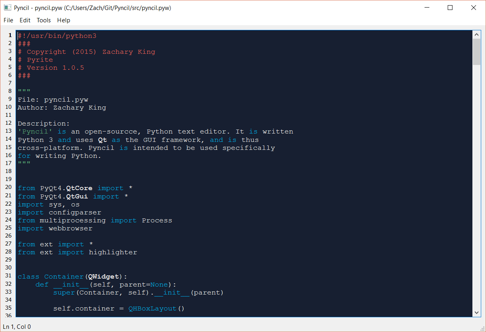

# Pyncil 
Pyncil is an open-source, cross-platform text editor and/or IDE, designed for Python. I know what 
you're thinking--oh great, another text editor "for the masses." Well, yes, but Pyncil 
isn't meant to storm the world of developers and usher in next-gen development. Instead, 
I designed Pyncil to work specifically for Python at its best, although you can easily 
extend it to work for other languages as well. Oh, and Pyncil was written completely in Python!

---

## Configuring Pyncil
Pyncil is designed to be easily configurable. There is a INI configuratino file (*src/config/settings.ini*) 
which contains all the juicy settings. This is also the file in which you will need to edit 
for certain extension options. So far, only support for extending the syntax highlighter 
has been implemented. 

---

## Extending Pyncil
To add you own syntax highlighter--say, for C++--just edit the 
*src/ext/highlighter.py* file by adding your own class that derives from the BaseHighlighter 
class within the same file. Then, in the settings file mentioned above, just set the setting for \
*Extensions -> Highlighter* to the name of your class. So I might write a class called CPPHighlighter 
to support syntax highlighting for C++ and then I would set the setting to *CPPHighlighter*. 
More details on the actual implementation of your class are found in the *highlighter.py* file.